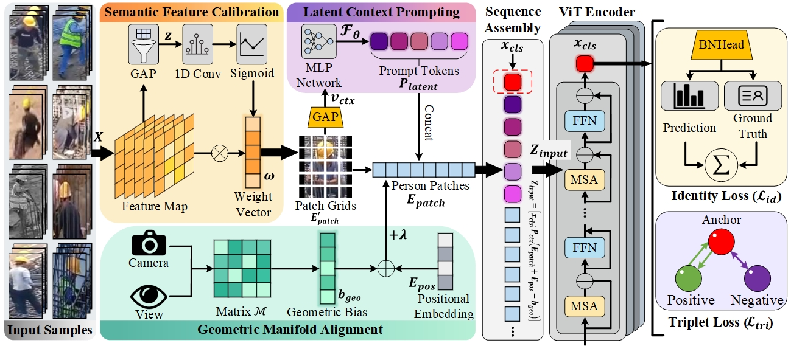

<div align="center">

# 🚀 SPDR-Net: Scene-Prompt-Driven Dynamic Routing Expert Network for Open-World Person Re-Identification

[](https://www.python.org/downloads/)
[](https://pytorch.org/)
[](https://opensource.org/licenses/MIT)
[]()
[](https://github.com/dongpeng011/SD-ReID)

**Official PyTorch Implementation of the SPDR-Net**  
*Tackling Spatially Asymmetric Interference via Mixture of Experts (MoE) & Dynamic Routing*


<br>
*(Figure: The overall architecture of SPDR-Net, integrating Semantic Part Experts, Prompt-Guided Dynamic Routing, and Global-Local Fusion.)*

</div>

---

## 📢 News
- **[🎉 2024/05]** The source code of **SPDR-Net** is officially released! 
- **[🔥 2024/05]** Our self-built challenging street-scene dataset **SD-ReID** is now publicly available!
- **[🚀 2024/05]** Supported YOLO-based closed-loop ReID deployment pipeline for real-world surveillance.

---

## ✨ Key Features
- 🧠 **Mixture of Experts (MoE) Architecture**: Innovatively treats pedestrian physical topologies (Head, Torso, Legs) as independent expert paths.
- 🚦 **Prompt-Guided Dynamic Routing (PGDR)**: Uses high-level scene semantics as a "soft logical switch" to dynamically cut off noise-polluted feature paths (e.g., severe partial occlusion).
- 📉 **Sparsity Routing Entropy Loss ($L_{ent}$)**: A novel information-theoretic constraint that forces the network to make decisive, highly confident routing decisions.
- 🏙️ **The SD-ReID Benchmark**: A brand new, highly challenging dataset captured from real-world street cameras, featuring extreme resolution variance, illumination shift, and dynamic occlusions.

---

## 🗂️ Datasets Preparation

We conduct extensive experiments on **8 mainstream benchmarks** and our **SD-ReID**. Please download the datasets and place them in your `data` directory.

| Dataset | Scenario | Download Link |
| :--- | :--- | :--- |
| **SD-ReID (Ours)** | **Real Street/Composite** | [Download Here](https://github.com/dongpeng011/SD-ReID) 🌟 |
| Market-1501 | Normal | [Kaggle Link](https://www.kaggle.com/datasets/pengcw1/market-1501/data) |
| MSMT17 | Normal / Multi-scene | [PKU Link](http://www.pkuvmc.com/dataset.html) |
| Occ-Duke | Severe Occlusion | [GitHub Link](https://github.com/lightas/Occluded-DukeMTMC-Dataset) |
| SYSU-mm01 | Infrared (Cross-modality) | [SYSU Link](https://www.isee-ai.cn/project/RGBIRReID.html) |
| Celeb-ReID | Clothing-Changing | [GitHub Link](https://github.com/Huang-3/Celeb-reID) |
| PRCC | Clothing-Changing | [SYSU Link](https://www.isee-ai.cn/%7Eyangqize/clothing.html) |
| MLR-CUHK03 | Low Resolution | [Baidu Disk](https://pan.baidu.com/s/1hMQZq0LAPhIl5RQ_EDDiFg) |

### 📂 Directory Structure
After downloading, please organize your dataset directory as follows and modify the root paths in the `./configs/` files:
```text
SPDR-Net/
├── data/
│   ├── SD-ReID/
│   │   ├── bounding_box_train/
│   │   ├── bounding_box_test/
│   │   └── query/
│   ├── market1501/
│   ├── msmt17/
│   └── ...

