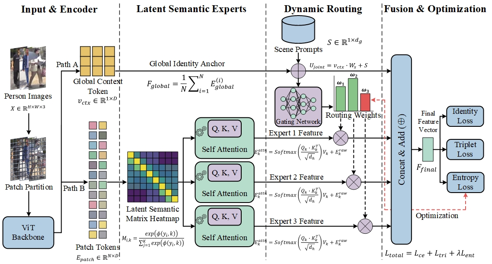

<div align="center">

# 🚀 SPDR-Net: Scene-Prompt-Driven Dynamic Routing Expert Network for Open-World Person Re-Identification

[](https://www.python.org/downloads/)
[](https://pytorch.org/)
[](https://opensource.org/licenses/MIT)
<br>
[]()
[](https://github.com/dongpeng011/SD-ReID)

**Official PyTorch Implementation of SPDR-Net & The SD-ReID Benchmark Dataset**  
*Tackling Spatially Asymmetric Interference via Mixture of Experts (MoE) & Dynamic Routing*


<br>
*(Figure: The overall architecture of SPDR-Net, integrating Semantic Part Experts, Prompt-Guided Dynamic Routing, and Global-Local Fusion.)*

</div>

---

## 📢 News & Updates
- **[🔥 2026/3]** The official source code of **SPDR-Net** is now publicly available! 
- **[🎉 2026/4]** Our self-built challenging street-scene dataset **SD-ReID** is released!
- **[🚀 2026/5]** Supported YOLO-based closed-loop ReID deployment pipeline for real-world video surveillance.

---

## ✨ Key Features

Conventional ReID models encounter significant limitations in open-world environments, especially when facing **Spatially Asymmetric Interference** (e.g., severe partial occlusion, local illumination shift). To overcome these challenges, we propose **SPDR-Net**:

- 🧠 **Semantic Part Experts (Mixture of Experts)**: Innovatively treats pedestrian physical topologies (Head, Torso, Legs) as independent expert paths with self-attention purification.
- 🚦 **Prompt-Guided Dynamic Routing (PGDR)**: Uses high-level scene semantics as a "soft logical switch" to dynamically evaluate and cut off noise-polluted feature paths.
- 📉 **Sparsity Routing Entropy Loss ($L_{ent}$)**: A novel information-theoretic constraint that forces the network to make decisive, highly confident routing decisions rather than trivial averages.
- 🤝 **Global-Local Collaborative Fusion**: Bridges the semantic gap between global macroscopic identity anchors and local purified details for extreme robustness.

---

## 🏙️ The SD-ReID Dataset

Existing datasets mostly focus on relatively clean campuses. To bridge the gap for real-world industrial and street scenarios, we constructed **SD-ReID (Street Deployment ReID)**. It is collected directly from highly complex street cameras.

### 📊 Dataset Statistics:
| Feature | Details | Feature | Details |
| :--- | :--- | :--- | :--- |
| **Total Images** | 10,426 | **Resolution** | Standardized to `64 × 128` |
| **Identities** | 147 | **Cameras** | 6 (Front, Side, Top-down views) |
| **Train/Test Split** | 117 IDs / 30 IDs | **Challenges** | Heavy Occlusion, Low-Res, Illumination Shift |

> **👉 [Click here to access and download the SD-ReID dataset](https://github.com/dongpeng011/SD-ReID)**

---

## 🏆 Main Results

SPDR-Net achieves **State-of-the-Art (SOTA)** performance across multiple public benchmarks and the SD-ReID dataset under both single-scene and multi-scene joint training settings.

| Dataset | Challenge | mAP (%) | Rank-1 (%) |
| :--- | :--- | :---: | :---: |
| **SD-ReID (Ours)** | **Real Street / Composite** | **99.0** | **99.9** |
| Market-1501 | Normal | 82.7 | 93.4 |
| MSMT17 | Normal / Multi-scene | 42.3 | 66.4 |
| Occ-Duke | Severe Occlusion | 62.1 | 75.6 |
| MLR-CUHK03 | Low Resolution | 87.7 | 91.9 |
| PRCC | Clothing-Changing | 53.1 | 40.3 |
| SYSU-mm01 | Infrared Cross-Modality | 41.9 | 43.6 |

---

## 🛠️ Getting Started

### 1. Prerequisites
- Linux (Ubuntu 22.04 recommended)
- Python $\ge$ 3.8
- PyTorch $\ge$ 2.0 (CUDA 12.1 recommended)

### 2. Installation
Clone the repository and install the required dependencies:
git clone https://github.com/dongpeng011/SD-ReID.git
cd SD-ReID

# Create conda environment (Optional but recommended)
conda create -n spdr python=3.8 -y
conda activate spdr

# Install dependencies
pip install -r requirements.txt


### 3. Data Preparation

## Download the SD-ReID dataset (and other public datasets if needed) and organize them in the data directory.
```
SD-ReID/
├── data/
│   ├── SD-ReID/
│   │   ├── bounding_box_train/
│   │   ├── bounding_box_test/
│   │   └── query/
│   ├── market1501/
│   └── msmt17/
├── models/
│   └── spdr_net.py
├── configs/
│   └── sd_reid.yml
└── train.py
(Note: Please ensure you modify the dataset root paths in your configuration files accordingly.)
```
### 4. Training & Evaluation

## To train the SPDR-Net model on the SD-ReID dataset:
python train.py --config_file configs/sd_reid.yml MODEL.DEVICE_ID "('0')"
## To evaluate a pre-trained model:
python test.py --config_file configs/sd_reid.yml MODEL.DEVICE_ID "('0')" \
               TEST.WEIGHT /path/to/your/best_model.pth

---

## 💡 System Application (YOLO + SPDR-Net)
To demonstrate the engineering deployment value, we provide a closed-loop multi-camera surveillance testing script integrating the state-of-the-art YOLO detector and our SPDR-Net weights.
(Visual results: SPDR-Net maintains cross-camera identity consistency perfectly even under severe overlap and occlusion.)

## 🙌 Acknowledgement
This repository is built upon the excellent open-source works of the computer vision community, particularly TransReID and VersReID. We sincerely thank the original authors for their outstanding contributions to the ReID community.

## 📝 Citation
## If you find our paper, code, or the SD-ReID dataset helpful in your research, please consider citing our work:
@article{SPDRNet2026,
  title={Scene-Prompt-Driven Dynamic Routing Expert Network for Open-World Person Re-Identification},
  author={Liu, Hongbin and Dong, Peng and others},
  journal={Under Review},
  year={2026}
}

## 📧 Contact
If you have any questions, please feel free to open an issue or contact: liuhongbin19@sdjzu.edu.cn.